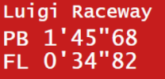

# Fancy Times in OBS
## Overview
The tool is composed of three parse
1. WebServer to server to host and serve two HTML pages. The webserver also servers to communicate between the two pages
2. Controller - Which is interactive and tells the display to update

3. Display - Which reacts to the  controller state

## Goal
Pull directly from website to avoid refreshing every time I change screen (not huge for one user, however it'd be really rude if this code was repurposed and a subtle enough problem to head off at the start).

https://api.mariokart64.com/players/1345/ranks

`https://api.mariokart64.com/players/{UserId}/ranks`

Which fancily enough: F12 tools found right away and appears to be public AND how the website is rendered.
- This explains why it looks so good on mobile and PC: local client rendering.

In practice this saves ~13 request and the remaining 20 are cached. (1.12s load time) to 50ms nice.

Also: OBS can refresh to be "always up to date" on scene activate, however I don't want 12 custom instances (and I can't see a native way to run scripts to modify the text/css selectors). 

A fun learning exercise (failed attempt) using OBS's browser and custom CSS to show the text suggested I might have a good idea (it worked OK).

With read access to OBS it should be possible to write a script in JS which reacts to scene changes to update titles/times.
(With full access I could apparently write an entire replacement GUI)

Goal: Make a remote for rapid switching based on Mario Kart track alone. No scene changes required (nice!) keeps scenes isolated to visual layout not addressable/modifable content.

Why? It's a fun problem and is nearly imposible to monitze. I needed a hobby that I couldn't reasonably expect to make money on using my programming skillset.

# Tools
- Kesterl
- Websockets

# Interface
- Presentation layer (OBS.html)
- Controller layer (Controller.html)

OBS will load the display in it's layer.

Controller will allow me to pick a track and send updates to OBS to update the track and times.

# Why Websockets?

The two-browser approach was choosen as I wanted to play with them. I also wasn't aware of a way to send messages or key-presses to the OBS Browser. Rather than dig into OBS specific APIs I wanted make something generic.

It wasn't until after I built the websocket version that I realized that OBS can embed the controller

It wasn't until I was documenting this readme that I discovered a single page could be made interactive (though not doc) and allow me to update the text with a single page.
